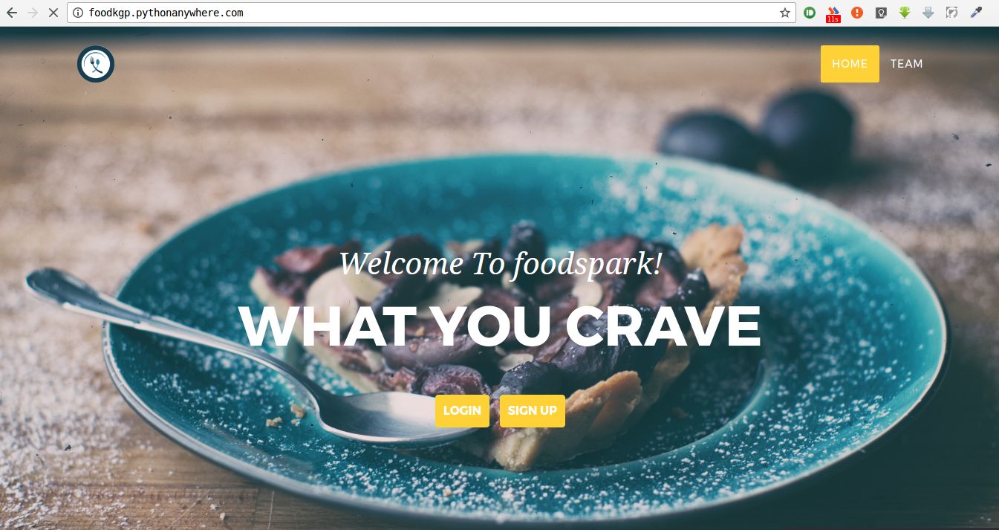

# Foodspark

DBMS project for online Food Ordering system.

Deployed on http://foodkgp.pythonanywhere.com

The frontend specifically can be found in `front-end/` folder.

To run the server, run the following command:

    python manage.py runserver

## Features
* Supports Restaurant and Customer login and signup.
* User can enter and edit details.
* User can place orders from multiple restaurants.
* Support search functionality from user side.
* A restaurant can update their menu and add new items to their menu.
* Both user and restaurant can check their history logs.
* Pretty darn good UI.

## Members
* Sourav Pal [@sourav-roni](https://github.com/sourav-roni)
* Sayan Mandal [@sayanmandal](https://github.com/sayanmandal)
* Projjal Chanda [@Projjal](https://github.com/projjal)
* Aditya Bhagwat [@Eraseread](https://github.com/Eraseread)
* Kaustubh Hiware [@kaustubhhiware](https://github.com/kaustubhhiware)
